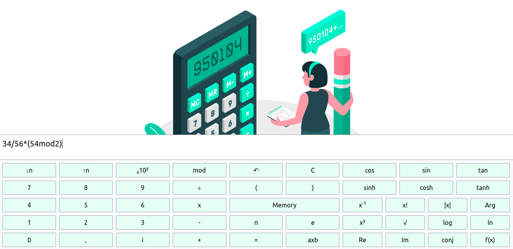

Calculadora Avançada

# CÓDIGO EM MANUTENÇÃO !!!!!

A Calculadora Avançada é uma aplicação web poderosa que oferece uma ampla gama de funcionalidades matemáticas avançadas. Ela é projetada para auxiliar em cálculos complexos, desde operações básicas até funções trigonométricas, exponenciais e muito mais.

Funcionalidades Principais
Realize cálculos matemáticos complexos com facilidade.
Suporte para operações básicas: adição, subtração, multiplicação e divisão.
Funções trigonométricas avançadas: seno, cosseno, tangente, etc.
Operações com números complexos.
Cálculo de funções exponenciais e logarítmicas.
Memória para armazenar valores temporários.
Interface amigável e intuitiva.
Como Usar
Entrada de Dados: Insira suas equações e cálculos na caixa de entrada localizada na parte superior da calculadora.

Operações Matemáticas: Utilize os botões na grade da calculadora para inserir números, operadores e funções matemáticas.

Memória: Você pode usar a função de memória para armazenar valores temporários e recuperá-los conforme necessário.

Resultado: O resultado do seu cálculo será exibido na área de exibição na parte superior da calculadora.

Exemplo de Uso
Para calcular a raiz quadrada de 25, insira "√(25)" na caixa de entrada e pressione "=". O resultado será exibido como "5".

Para calcular o seno de 45 graus, insira "sin(45)" na caixa de entrada e pressione "=". O resultado será exibido em formato decimal.

Contribuição
Este projeto é de código aberto e aceitamos contribuições da comunidade de desenvolvedores. Se você deseja melhorar ou adicionar recursos à Calculadora Avançada, sinta-se à vontade para enviar um pull request.

Licença
Este projeto está licenciado sob a Licença MIT. Consulte o arquivo LICENSE para obter detalhes.

Lembre-se de substituir a imagem do screenshot (/assets/images/screenshot.png) pelo caminho correto para uma captura de tela real do seu projeto, e ajustar os exemplos de uso de acordo com as funcionalidades específicas da sua calculadora.
